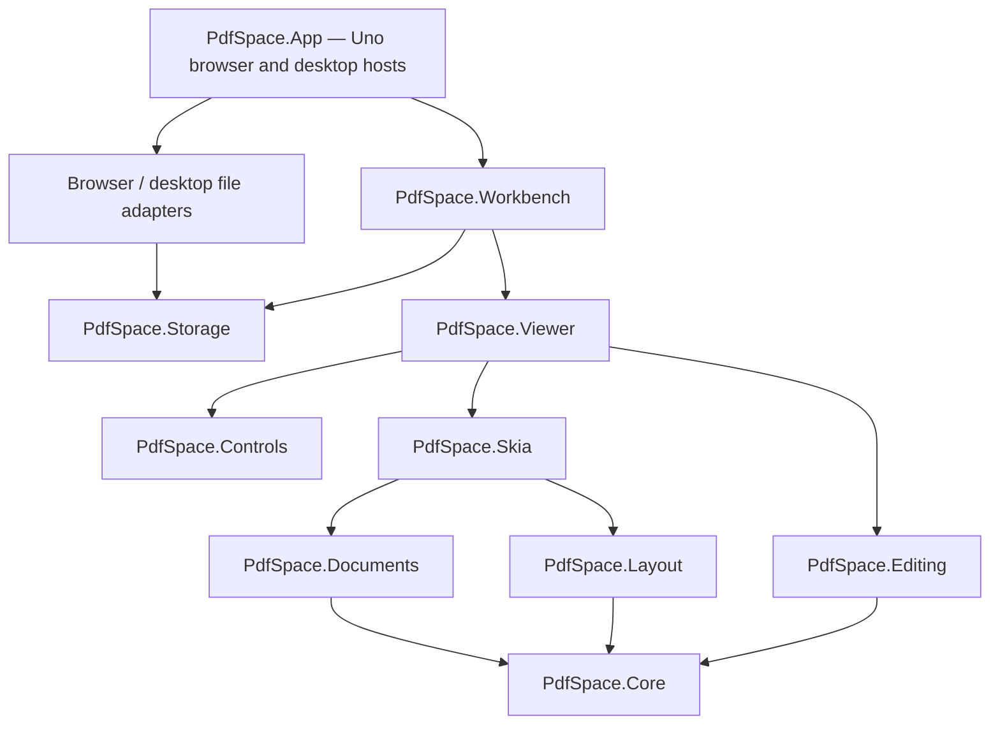

# Architecture

## Boundaries

Core, Layout and Editing do not depend on Uno, rendering APIs, storage or application services. The UI packages use real Uno controls and `SKCanvasElement`; the app does not delegate editing to an HTML canvas application or PDF.js viewer.

## Document state

A workspace owns immutable source-PDF byte arrays, ordered page records and editable annotation records. A page refers to an original source and source-page number, or has no source for a blank page. Crop and rotation are workspace operations rather than destructive changes to source bytes.

`EditorSession.Execute` creates a validated document snapshot and one named history entry. Undo and redo retain up to 100 entries; original source arrays are shared, not copied per gesture. Selection, tools, zoom and scroll are view state rather than document changes. The saved snapshot is tracked by reference identity so undoing to that snapshot restores the clean state.

Annotation coordinates are PDF points with a top-left origin in the logical source page. Layout applies crop and quarter-turn rotation separately, then viewport zoom and translation. `PageGeometry` owns reversible source/display transforms; all pointer tools use the same transform as rendering.

## Rendering

PdfPig parses the document; PdfPig.Rendering.Skia produces an `SKPicture` for a page. `PdfRenderer` owns parsed sources and an LRU of pictures with a default capacity of twelve. The document viewport and thumbnail view share a renderer. Offscreen pages are not painted. Each document tab owns its own renderer and releases it when closed.

Skia paints the original page, then workspace annotations. PDF export replays these visual operations into an `SKDocument` PDF canvas. PNG export rasterizes one visible page. This is a visual-export architecture—not a source-PDF object-preserving writer. See the compatibility document before adding preservation claims.

The current renderer is single-thread-affine. Parsing/export can occupy the UI thread on complex input. Do not call a shared renderer concurrently; a future worker adapter should create an isolated renderer and pass immutable workspace snapshots.

## UI composition

`PdfCommandButton`, `PdfIcon`, `PdfDocumentTab`, `PdfToolPanel`, `PdfColorPalette` and `PdfDialogHost` define the common visual language. Icons are original vector paths drawn by Skia. Shell layout, quick tools, navigation rail, review cards and organization view are custom Uno compositions. Text editing uses a styled Uno `TextBox` for platform text input, not a replacement IME implementation.

The viewport is an independent control. It supports source-page painting, inline annotation text, pointer capture, drawing, selection and resizing. The workbench adds document tabs, review/search/metadata panels and file commands. The desktop and browser host inject platform storage rather than embedding platform logic in the engines.

## Recovery and diagnostics

Browser recovery is stored in IndexedDB; desktop recovery uses an atomic temporary-file replacement. The workbench debounces saves and rechecks the snapshot while an asynchronous save is in flight. The current recovery slot holds the active workspace, not every open tab. Exporting a workspace is the durable backup mechanism.

Browser acceptance tests use `?test=1` to enable read-only state and control-position diagnostics. They still perform real pointer/keyboard/file-picker interactions. Production sessions do not publish document diagnostics. No test-only mutation API is provided.
