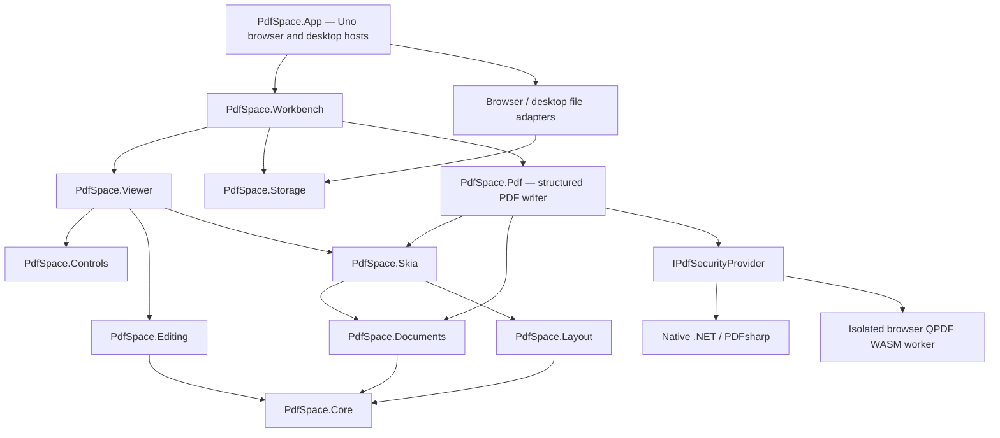

# Architecture

## Boundaries

Core, Layout and Editing do not depend on Uno, rendering APIs, storage or application services. The UI packages use real Uno controls and `SKCanvasElement`; the app does not delegate editing to an HTML canvas application or PDF.js viewer.

## Document state

A workspace owns immutable source-PDF byte arrays, ordered page records and editable annotation records. A page refers to an original source and source-page number, or has no source for a blank page. Crop and rotation are workspace operations rather than destructive changes to source bytes.

`EditorSession.Execute` creates a validated document snapshot and one named history entry. Undo and redo retain up to 100 entries; original source arrays are shared, not copied per gesture. Selection, tools, zoom and scroll are view state rather than document changes. The saved snapshot is tracked by reference identity so undoing to that snapshot restores the clean state.

Annotation coordinates are PDF points with a top-left origin in the logical source page. Layout applies crop and quarter-turn rotation separately, then viewport zoom and translation. `PageGeometry` owns reversible source/display transforms; all pointer tools use the same transform as rendering.

## Rendering

PdfPig parses the document; PdfPig.Rendering.Skia produces an `SKPicture` for a page. `PdfRenderer` owns parsed sources and an LRU of pictures with a default capacity of twelve. The document viewport and thumbnail view share a renderer. Offscreen pages are not painted. Each document tab owns its own renderer and releases it when closed.

Skia paints the preview source, then workspace annotations and form appearances. A preview-only source copy excludes supported imported objects represented by these overlays so they are not painted twice. It never replaces the editable original source bytes.

Default PDF export uses `PdfDocumentEngine.Save`, a PDFsharp-backed object writer that retains native page content and synchronizes supported annotations and AcroForms. An original single-source page sequence retains its catalog subject to the documented rewrite limitations. Page reassembly creates a new catalog and reports preservation warnings; imported form reassembly, XFA and signed-document changes are blocked rather than silently flattened. This is not an incremental-update writer and is not a guarantee of lossless arbitrary-PDF preservation.

The separately labeled flattened PDF exporter replays Skia visual operations into an `SKDocument`. PNG export rasterizes one page. Applied redaction is a distinct destructive exporter: it rasterizes every page, overwrites marked pixels, and writes only fresh page images into a new PDF. Source text, native objects and catalogs do not enter that output. Original documents and workspaces remain unredacted. See `compatibility.md` for the separate export contracts.

The current renderer is single-thread-affine. Parsing/export can occupy the UI thread on complex input. Do not call a shared renderer concurrently; a future worker adapter should create an isolated renderer and pass immutable workspace snapshots.

## UI composition

`PdfCommandButton`, `PdfIcon`, `PdfDocumentTab`, `PdfToolPanel`, `PdfColorPalette` and `PdfDialogHost` define the common visual language. Icons are original vector paths drawn by Skia. Shell layout, quick tools, navigation rail, review cards and organization view are custom Uno compositions. Text editing uses a styled Uno `TextBox` for platform text input, not a replacement IME implementation.

The viewport is an independent control. It supports source-page painting, inline annotation text, pointer capture, drawing, selection and resizing. The workbench adds document tabs, review/search/metadata panels and file commands. The desktop and browser host inject platform storage rather than embedding platform logic in the engines.

## Recovery and diagnostics

Browser recovery is stored in IndexedDB; desktop recovery uses an atomic temporary-file replacement. The workbench debounces saves and rechecks the snapshot while an asynchronous save is in flight. The current recovery slot holds the active workspace, not every open tab. Decrypted sources are marked sensitive and excluded from automatic recovery. Explicit workspace and form-data exports warn about unencrypted sensitive content. Exporting a workspace is the durable backup mechanism, not a sanitization operation.

Browser acceptance tests use `?test=1` to enable read-only state and control-position diagnostics. They still perform real pointer/keyboard/file-picker interactions. Production sessions do not publish document diagnostics. No test-only mutation API is provided.

## Native PDF workflows (0.2)

`PdfSpace.Pdf` adds a PDFsharp-backed object writer alongside the existing Skia visual exporter. The default PDF export keeps native source page content and synchronizes supported annotation and AcroForm objects. Source-catalog retention is limited to original single-source page order. Appearance streams use Skia glyph outlines and explicit graphics state. Source text edits replace supported operands with encoding/identity guards, then rehydrate the preview source.

`IPdfSecurityProvider` separates platform cryptography from document editing. The desktop provider uses .NET/PDFsharp; the browser provider marshals one request to a short-lived QPDF WASM worker with explicit owner authentication. It does not replace the Uno/Skia rendering engine. The worker and its exact runtime hashes are collected under `security/` in the published static root. No server receives document data.

Logical field properties are synchronized across widgets in an editing transaction. Native widget deletion detaches both the page annotation and the field-tree reference, retaining siblings and pruning only empty ancestors. Form input commits before Tab traversal. Password-protected source data is represented as an explicitly sensitive in-memory working copy and is excluded from implicit recovery.

## Recognition (0.3)

`PdfSpace.Ocr` renders only source visuals, never current form values or annotation overlays, and requests bounded TSV from an injected provider. Results remain detached until the original workspace snapshot is still current. Serializable per-word layers join the ordinary word-selection/search path. The structured PDF writer embeds Unicode-mapped invisible text and normalizes editable metadata across crop/rotation; it replaces only its owned streams. Browser workers are reused within a batch, then terminated. Native providers use process stdin/stdout without image temp files. See `docs/ocr.md`.
